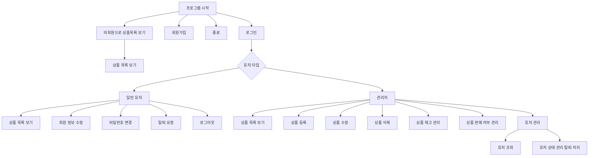

# java_final_eCommerce

> 💡 목표: e-commerce 기능 구현 Java App 개발
## 작업 범위
- [x] 사용자 관리 구현
  - [x] 회원 가입 기능
  - [x] 회원 탈퇴 기능
  - [x] 로그인 / 로그아웃 기능
  - [x] 사용자 정보 조회 기능(관리자 로그인 시)
  - [x] 사용자 탈퇴 처리 기능(관리자 로그인 시)
- [x] 상품 관리 구현
  - [x] 상품 등록 기능
  - [x] 상품 수정 기능
  - [x] 상품 삭제 기능
  - [x] 상품 재고 변경 기능
  - [x] 상품 판매 여부 관리 기능
- [x] 상품 전시 구현
  - [x] 목록 조회 기능(비회원 포함)
  - [x] 세부 사항 조회 기능
  - [x] 상품 검색 기능

## 실행 방법
1. DB 접속을 위한 `URL` 주소를 local Wallet 파일 주소로 변경
   - `src/util/ConnectionManager.java` 파일에서 변경 가능
   - `id`/`pw`는 코드 내 key-in되어 있음
2. `src/Main.java` 실행
3. 로그인 시 아래 계정 사용
   - Administrator 계정(=상품 관리 기능 가능)
     - id: admin@gmail.com
     - pw: Admin1
   - General User 계정
     - id: kopo@gmail.com
     - pw: Kopo1

## 실행 환경
- 운영체제
  - macOS Sequoia 15.3.1
- JDK 버전
  - openjdk 23.0.1
- 빌드 도구
  - Gradle
- 데이터베이스
  - Oracle Cloud DB
- 외부 라이브러리
  - OJDBC11-full

## 구현 영상
- 영상 첨부
  - 제출 zip 파일 내 `java_final_eCommerce_구현영상.mp4` 영상 파일

## 특이 사항
### ChatGPT 인용
- `updatePassword()`에서 기존 id, pw를 확인하고, 새로운 pw를 설정하는 로직을 인용하였습니다.
  - `src/dao/UserDAO.java` 파일의 `updatePassword()` 메서드
- `generateProductCode()`에서 고유한 productCode를 생성하기 위한 로직 인용
  - `src/dao/ProductDAO` 파일의 `generateProductCode()` 메서드
### DB 테이블 수정
- DB의 `TB_PRODUCT` 테이블에 `SALE_STATUS` 열을 추가하여 판매 중인지, 그렇지 않은지 상태를 저장합니다.  
### 사용자 구분 코드별 렌더링
- `AdminMenuView.java` / `UserMenuView.java`로 각각 관리자, 사용자에 대해 다른 렌더링 뷰를 제공합니다.
- 상품 목록 조회 시 **관리자 로그인**일 때만 상품 코드가 노출됩니다.

## 프로그램 작동 구조

## 코드 구조

```mermaid
flowchart TD
    main[Main.java]:::entry

    subgraph Controllers
        adminCtrl[AdminProductController]:::controller
        loginCtrl[LoginController]:::controller
        signupCtrl[SignupController]:::controller
        userCtrl[UserController]:::controller
    end

    subgraph Views
        adminView[AdminMenuView]:::view
        loginView[LoginView]:::view
        detailView[ProductDetailView]:::view
        listView[ProductListView]:::view
        signupView[SignupView]:::view
        userView[UserMenuView]:::view
    end

    subgraph Models
        productModel[Product]:::model
        userModel[User]:::model
    end

    subgraph DAOs
        productDAO[ProductDAO]:::dao
        userDAO[UserDAO]:::dao
    end

    subgraph DTOs
        productInsertDto[ProductInsertDTO]:::dto
        loginRequestDto[UserLoginRequestDTO]:::dto
        loginResponseDto[UserLoginResponseDTO]:::dto
        userModifyDto[UserModifyDTO]:::dto
        userInsertDto[UserInsertDTO]:::dto
    end

    subgraph Utilities
        connMgr[ConnectionManager]:::util
        dateFmt[DateFormatter]:::util
        priceFmt[FormatPrice]:::util
        session[UserSession]:::util
        validator[Validator]:::util
    end

    subgraph Exceptions
        dataEx[DataAccessException]:::exception
        insertEx[InsertFailedException]:::exception
        modifyQtyEx[NotValidModifyQuantityCommandException]:::exception
        inputEx[NotValidProductInputException]:::exception
        pwEx[PasswordMismatchException]:::exception
        updateEx[UpdateFailedException]:::exception
    end

    db[(Database)]:::dao

    %% Entry point
    main --> adminCtrl
    main --> loginCtrl
    main --> signupCtrl
    main --> userCtrl

    %% Controller → View, Model, DAO
    adminCtrl --> adminView
    adminCtrl --> productModel
    adminCtrl --> productDAO
    loginCtrl --> loginView
    loginCtrl --> userModel
    loginCtrl --> userDAO
    signupCtrl --> signupView
    signupCtrl --> userModel
    signupCtrl --> userDAO
    userCtrl --> userView
    userCtrl --> userModel
    userCtrl --> userDAO

    %% Additional view links
    adminCtrl --> listView
    adminCtrl --> detailView

    %% Controller → Utilities
    adminCtrl --> validator
    loginCtrl --> validator
    signupCtrl --> validator
    userCtrl --> session

    %% DAO → Utilities
    productDAO --> connMgr
    userDAO --> connMgr

    %% DAO → DTOs
    productDAO --> productInsertDto
    userDAO --> loginRequestDto
    userDAO --> loginResponseDto
    userDAO --> userModifyDto
    userDAO --> userInsertDto

    %% DAO → DB
    productDAO --> db
    userDAO --> db

    %% Exception dotted lines
    adminCtrl -.-> dataEx
    loginCtrl -.-> pwEx
    signupCtrl -.-> insertEx
    userCtrl -.-> modifyQtyEx
    productDAO -.-> updateEx
    userDAO -.-> inputEx

    %% Styles
    classDef entry fill:#f9f,stroke:#333,stroke-width:2px;
    classDef controller fill:#bbf,stroke:#333,stroke-width:2px;
    classDef model fill:#cfc,stroke:#333,stroke-width:2px;
    classDef view fill:#fcf,stroke:#333,stroke-width:2px;
    classDef dao fill:#cff,stroke:#333,stroke-width:2px;
    classDef dto fill:#ccf,stroke:#333,stroke-width:2px;
    classDef util fill:#ffc,stroke:#333,stroke-width:2px;
    classDef exception fill:#fcc,stroke:#333,stroke-width:2px;

    %% Click Events
    click main "github.com/seungineer/java_final_eCommerce_sgnr/tree/main/src/Main.java"
    click adminCtrl "github.com/seungineer/java_final_eCommerce_sgnr/tree/main/src/controller/AdminProductController.java"
    click loginCtrl "github.com/seungineer/java_final_eCommerce_sgnr/tree/main/src/controller/LoginController.java"
    click signupCtrl "github.com/seungineer/java_final_eCommerce_sgnr/tree/main/src/controller/SignupController.java"
    click userCtrl "github.com/seungineer/java_final_eCommerce_sgnr/tree/main/src/controller/UserController.java"
    click adminView "github.com/seungineer/java_final_eCommerce_sgnr/tree/main/src/view/AdminMenuView.java"
    click loginView "github.com/seungineer/java_final_eCommerce_sgnr/tree/main/src/view/LoginView.java"
    click detailView "github.com/seungineer/java_final_eCommerce_sgnr/tree/main/src/view/ProductDetailView.java"
    click listView "github.com/seungineer/java_final_eCommerce_sgnr/tree/main/src/view/ProductListView.java"
    click signupView "github.com/seungineer/java_final_eCommerce_sgnr/tree/main/src/view/SignupView.java"
    click userView "github.com/seungineer/java_final_eCommerce_sgnr/tree/main/src/view/UserMenuView.java"
    click productModel "github.com/seungineer/java_final_eCommerce_sgnr/tree/main/src/model/Product.java"
    click userModel "github.com/seungineer/java_final_eCommerce_sgnr/tree/main/src/model/User.java"
    click productDAO "github.com/seungineer/java_final_eCommerce_sgnr/tree/main/src/dao/ProductDAO.java"
    click userDAO "github.com/seungineer/java_final_eCommerce_sgnr/tree/main/src/dao/UserDAO.java"
    click productInsertDto "github.com/seungineer/java_final_eCommerce_sgnr/tree/main/src/dto/ProductInsertDTO.java"
    click loginRequestDto "github.com/seungineer/java_final_eCommerce_sgnr/tree/main/src/dto/UserLoginRequestDTO.java"
    click loginResponseDto "github.com/seungineer/java_final_eCommerce_sgnr/tree/main/src/dto/UserLoginResponseDTO.java"
    click userModifyDto "github.com/seungineer/java_final_eCommerce_sgnr/tree/main/src/dto/UserModifyDTO.java"
    click userInsertDto "github.com/seungineer/java_final_eCommerce_sgnr/tree/main/src/dto/UserInsertDTO.java"
    click connMgr "github.com/seungineer/java_final_eCommerce_sgnr/tree/main/src/util/ConnectionManager.java"
    click dateFmt "github.com/seungineer/java_final_eCommerce_sgnr/tree/main/src/util/DateFormatter.java"
    click priceFmt "github.com/seungineer/java_final_eCommerce_sgnr/tree/main/src/util/FormatPrice.java"
    click session "github.com/seungineer/java_final_eCommerce_sgnr/tree/main/src/util/UserSession.java"
    click validator "github.com/seungineer/java_final_eCommerce_sgnr/tree/main/src/util/Validator.java"
    click dataEx "github.com/seungineer/java_final_eCommerce_sgnr/tree/main/src/exception/DataAccessException.java"
    click insertEx "github.com/seungineer/java_final_eCommerce_sgnr/tree/main/src/exception/InsertFailedException.java"
    click modifyQtyEx "github.com/seungineer/java_final_eCommerce_sgnr/tree/main/src/exception/NotValidModifyQuantityCommandException.java"
    click inputEx "github.com/seungineer/java_final_eCommerce_sgnr/tree/main/src/exception/NotValidProductInputException.java"
    click pwEx "github.com/seungineer/java_final_eCommerce_sgnr/tree/main/src/exception/PasswordMismatchException.java"
    click updateEx "github.com/seungineer/java_final_eCommerce_sgnr/tree/main/src/exception/UpdateFailedException.java"
```

- `Main.java`를 진입점으로 하여 사용자의 로그인, 회원가입, 상품 등록 및 조회와 같은 핵심 흐름을 컨트롤러 계층에서 분기한다.
- 각 컨트롤러는 `DTO`를 통해 사용자 입력을 전달받고 `DAO`를 통해 실제 데이터베이스에 접근하여 상품, 사용자 등 주요 모델을 조작한다.
- 유틸리티 클래스는 입력 검증과 가격/날짜 포맷을 담당하며, 예외 계층은 입력 오류나 DB 작업 실패를 분리 처리한다.
